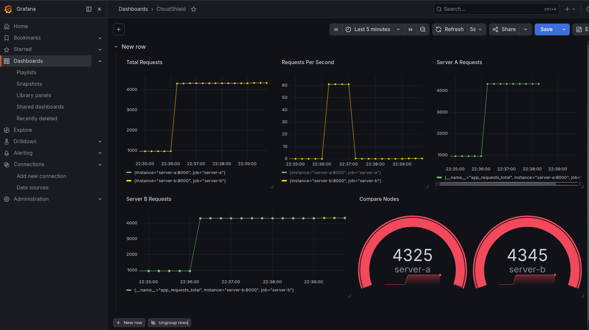

# CloudShield

## Distributed Load Balancing and Real-Time Monitoring Platform

CloudShield is a containerized cloud infrastructure project designed to demonstrate how modern production systems handle traffic distribution, backend scalability, and observability.

The platform uses multiple backend application nodes behind a reverse proxy load balancer, with real-time metrics collection and monitoring dashboards.

It showcases practical concepts used in DevOps, SRE, Cloud Engineering, and backend infrastructure environments.

---

## Features

* Reverse proxy load balancing using Nginx
* Multi-node FastAPI backend architecture
* Real-time monitoring with Prometheus
* Interactive dashboards with Grafana
* Fully Dockerized infrastructure
* Traffic routing across multiple backend nodes
* Request analytics and throughput metrics
* Stress-test ready environment
* Scalable microservice architecture

---

## Architecture Overview

```text
                 Client Requests
                        |
                        v
             +--------------------+
             |       Nginx        |
             | Reverse Proxy / LB |
             +---------+----------+
                       |
            +----------+----------+
            |                     |
            v                     v
     +-------------+       +-------------+
     |  Server A   |       |  Server B   |
     |   FastAPI   |       |   FastAPI   |
     +------+------+       +------+------+
            |                     |
            +----------+----------+
                       |
                       v
               +--------------+
               | Prometheus   |
               | Metrics      |
               +------+-------+
                      |
                      v
               +--------------+
               | Grafana      |
               | Dashboard    |
               +--------------+
```

---

## Tech Stack

| Layer            | Technology     |
| ---------------- | -------------- |
| Backend API      | FastAPI        |
| Load Balancer    | Nginx          |
| Monitoring       | Prometheus     |
| Visualization    | Grafana        |
| Containerization | Docker         |
| Orchestration    | Docker Compose |

---

## Project Structure

```text
CloudShield/
│── docker-compose.yml
│
├── nginx/
│   ├── Dockerfile
│   └── nginx.conf
│
├── server-a/
│   ├── Dockerfile
│   ├── app.py
│   └── requirements.txt
│
├── server-b/
│   ├── Dockerfile
│   ├── app.py
│   └── requirements.txt
│
├── prometheus/
│   ├── Dockerfile
│   └── prometheus.yml
│
└── README.md
```

---

## Setup and Run

### Clone Repository

```bash
git clone <your-repo-url>
cd CloudShield
```

### Start All Services

```bash
docker compose up --build
```

---

## Service Endpoints

| Service          | URL                                            |
| ---------------- | ---------------------------------------------- |
| Main Application | [http://localhost](http://localhost)           |
| Prometheus       | [http://localhost:9090](http://localhost:9090) |
| Grafana          | [http://localhost:3000](http://localhost:3000) |

---

## Grafana Login

```text
Username: admin
Password: admin
```

Change the credentials after first login.

---

## Dashboard Metrics

CloudShield tracks:

* Total requests
* Requests per second
* Node-wise request distribution
* Backend traffic comparison
* Live request flow
* Load balancing behavior

---

## Testing Performed

### Load Balancing Validation

Traffic was distributed across:

* Server A
* Server B

### Single Node Handling

Traffic routed successfully when one server handled requests independently.

### Real-Time Monitoring

Metrics were visualized in Grafana through Prometheus scraping.

### Traffic Recording

Screen recordings captured:

* Balanced traffic across both servers
* Traffic served by a single backend node
* Live dashboard metric changes

---

## Core Concepts Explained

### 1. Reverse Proxy & Load Balancing (Nginx)
A **Reverse Proxy** sits in front of web servers and forwards client requests to those web servers. In CloudShield, Nginx acts as this proxy, providing a single point of entry and hiding the internal network topology. 
As a **Load Balancer**, Nginx distributes incoming network traffic across our backend servers (`Server A` and `Server B`). This ensures no single server bears too much demand, improving overall application responsiveness and availability.

### 2. Microservice Architecture (FastAPI & Docker)
The backend is composed of multiple identical services. Running these as independent Docker containers allows each node to be scaled, restarted, or managed independently without bringing down the entire system. FastAPI provides a high-performance, lightweight Python framework for these backend endpoints.

### 3. Real-Time Observability (Prometheus & Grafana)
* **Prometheus** is a time-series database and monitoring tool that periodically "scrapes" (pulls) metrics from the backend servers. 
* **Grafana** is a visualization platform that connects to Prometheus. It queries the gathered metrics and displays them on interactive dashboards, allowing us to monitor system health, traffic distribution, and overall throughput in real time.

---

## Demo Assets

### Grafana Dashboard View
The Grafana dashboard provides real-time visualization of the metrics collected by Prometheus, allowing us to monitor total requests, requests per second, and traffic distribution among the backend nodes.



### Load Balancing Demo
In this recording, you can see Nginx balancing the incoming HTTP requests between `Server A` and `Server B`. The requests are dynamically distributed, demonstrating a functioning load balancer under active traffic.

<video src="./recordings/load-balancing-demo.mp4" controls="controls" style="max-width: 100%;">
  Your browser does not support the video tag. <a href="./recordings/load-balancing-demo.mp4">Download the video</a>.
</video>

### Single Node Operation Demo
This recording demonstrates the system operating when only a single node is serving requests. This highlights how the reverse proxy handles traffic when routing to an independent server, which is useful for understanding single-server deployment scenarios or simulating failover.

<video src="./recordings/single-node-demo.mp4" controls="controls" style="max-width: 100%;">
  Your browser does not support the video tag. <a href="./recordings/single-node-demo.mp4">Download the video</a>.
</video>

---

## Learning Outcomes

This project demonstrates hands-on understanding of:

* Reverse proxy concepts
* Load balancing strategies
* Container networking
* Metrics collection
* Infrastructure monitoring
* Distributed backend systems
* Cloud-native deployment models

---

## Future Improvements

* Health checks and auto failover
* Rate limiting and traffic protection
* HTTPS / SSL termination
* Auto scaling containers
* CI/CD pipeline
* Kubernetes deployment
* Cloud hosting on AWS, Azure, or GCP


---

## Author

Harish

---

## License

This project is for educational
